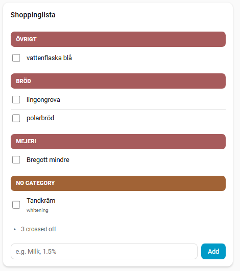
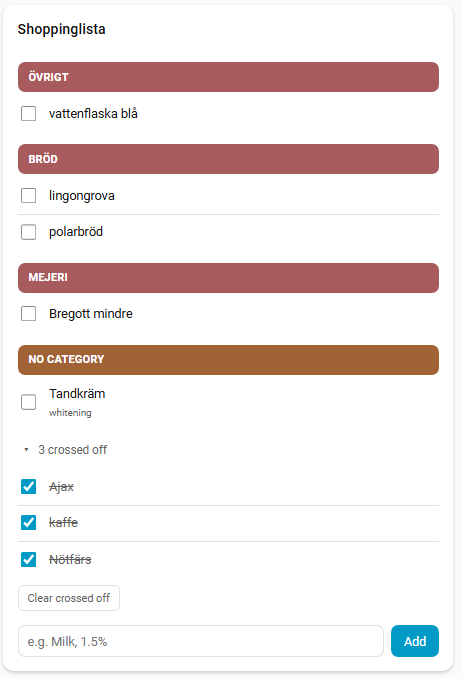
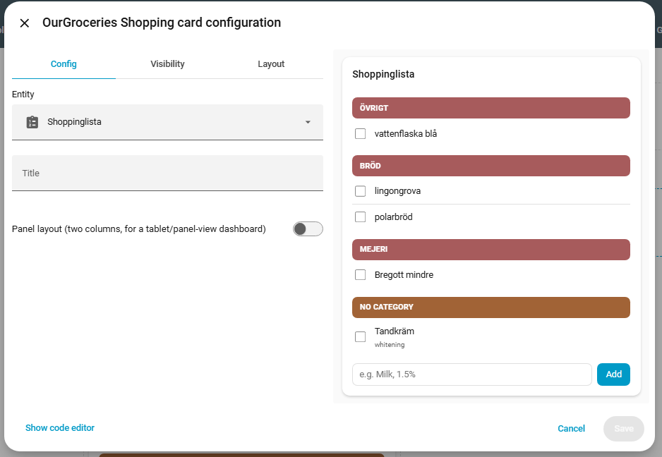
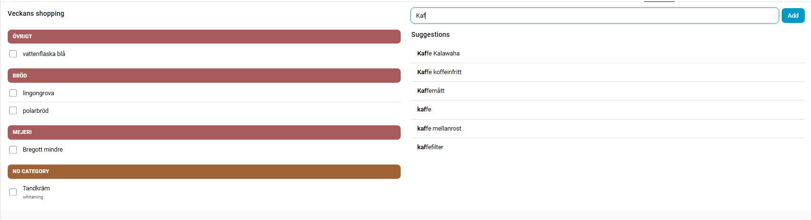

# OurGroceries Shopping Card

[](https://github.com/hacs/integration)
[](https://github.com/johro897/ourgroceries-shopping-card/releases)

A Lovelace shopping-list card for a Home Assistant `todo.*` entity: items grouped by category, with a click-to-add suggestions dropdown sourced from your OurGroceries item history.



---

## How it works

This card doesn't talk to OurGroceries directly. It reads and writes your list entirely through Home Assistant's standard `todo.*` services against whatever `entity:` you configure — normally an entity from the companion [ourgroceries-sync](https://github.com/johro897/ourgroceries-sync) integration, but it'll work against any `todo` entity from any source (including HA's built-in [OurGroceries integration](https://www.home-assistant.io/integrations/ourgroceries/), if you're using that instead).

Category grouping and suggestions both come from the separate, optional companion integration [ourgroceries-sync](https://github.com/johro897/ourgroceries-sync), via two of its services (`get_categories`, `get_suggestions`). Without it installed — or against a `todo.*` entity from some other source — the card still works fully: it just falls back to a flat, ungrouped list with no suggestions.

---

## Features

- Checklist-style list: checkbox + item name, click to mark done/undone
- Crossed-off items are hidden from the main list by default (this card is for planning, not a shopping log) — a collapsed "N crossed off" section holds them, with an uncheck action and a delete action (per item or all at once), so an everyday checkbox tap is never destructive
- Items grouped under a category header bar (color assigned per category name, not from OurGroceries — see "How categories work" below), when the companion integration provides category data
- Remove button per item (shown on hover)
- Add-item field with a click-to-add suggestions dropdown, sourced from your OurGroceries history — clicking a suggestion adds it immediately, no separate Add step (requires [ourgroceries-sync](https://github.com/johro897/ourgroceries-sync))
- Type a note along with a new item using a comma, e.g. `Milk, 1.5%` — shown as subtext under the item, same as a suggestion's note (requires [ourgroceries-sync](https://github.com/johro897/ourgroceries-sync); editing a note on an existing item isn't supported yet, see [issue #10](https://github.com/johro897/ourgroceries-shopping-card/issues/10))
- Visual editor — entity, title, and panel layout are all configurable from the dashboard UI, YAML is optional
- Optional panel layout for a tablet/panel-view dashboard: two columns, list on the left, an always-visible (not dropdown) suggestions column on the right that live-filters as you type
- Theme-aware styling, no external dependencies



## How categories work

Category *names* come from your OurGroceries account. Category *colors* don't — OurGroceries' API doesn't expose one, so this card assigns a color to each category by hashing its name, consistently across reloads.

Items with genuinely no category at all are grouped under a "No category" bucket at the end of the list — this is a bucket the card makes up, not something from OurGroceries. In practice you'll rarely see it: OurGroceries usually auto-assigns *some* real category (which might itself be named something like "Other" or "Miscellaneous" in your account) to items it can't confidently place, and that's a real category with its own color like any other, distinct from this card's fallback bucket. If you see both a real "Other"-ish category *and* "No category" on the same list, that's expected — they're two different things that happen to sound similar.

---

## Installation

### Via HACS

1. HACS → ⋮ → Custom repositories → add `https://github.com/johro897/ourgroceries-shopping-card`, category **Dashboard**
2. Search for **OurGroceries Shopping Card** and install
3. Add the resource if HACS doesn't do it automatically: **Settings → Dashboards → Resources**

### Manual

1. Copy `ourgroceries-shopping-card.js` to `/config/www/ourgroceries-shopping-card.js`
2. Add the resource: **Settings → Dashboards → Resources → +**
   ```yaml
   url: /local/ourgroceries-shopping-card.js
   type: module
   ```

---

## Configuration

Editable visually (Edit Dashboard → Add Card → search for this card, or Edit a card already on your dashboard), or in YAML:



```yaml
type: custom:ourgroceries-shopping-card
entity: todo.groceries
title: Groceries   # optional — defaults to the entity's own friendly name
panel: false       # optional — two-column layout, see "Panel layout" below
input_position: bottom  # optional — "top" puts the add field above the list
max_height: 480    # optional — cap the card's height; the list scrolls inside
```

| Option | Type | Default | Description |
|---|---|---|---|
| `entity` | string | **required** | A `todo.*` entity |
| `title` | string | *(entity's friendly name)* | Card title |
| `panel` | boolean | `false` | Two-column layout for a tablet/panel-view dashboard — see below |
| `input_position` | `bottom` \| `top` | `bottom` | Where the add-item field sits in the compact layout. `top` keeps it above the list — handy with a fixed card height |
| `max_height` | number (px) or CSS length | *(none)* | Caps the card's height (e.g. `480`, `60vh`); the list then scrolls inside the card. For dashboards that don't use the sections grid — in a sections view, use the card's grid rows instead (see below) |

### Fixed height (sections view, wall tablets)

In a **sections** view the card follows the grid. By default its height is `auto` and it grows with the list, exactly as before. Give it a fixed number of rows and it fills exactly that space instead — the title and add field stay put, and only the list scrolls inside the card, so the page itself never has to scroll:

```yaml
type: custom:ourgroceries-shopping-card
entity: todo.groceries
input_position: top
grid_options:
  columns: full
  rows: 8
```

The suggestions dropdown opens downward as before, and flips upward (capped to the available space) when there isn't room below — e.g. with the add field at the bottom of a fixed-height card near the bottom of the screen. The add field also keeps its focus and text while the list refreshes, so a tablet's on-screen keyboard doesn't close mid-typing when another device changes the list.

### Panel layout

Set `panel: true` on a card placed in a Home Assistant **panel view** (a dashboard view with a single card filling the whole screen — good for a wall-mounted tablet). Splits the card into two columns: your list on the left, and a suggestions column on the right that's always visible (rather than a dropdown that only appears while typing) and live-filters as you type in the add-item field, which lives at the top of that column.



This is a manual toggle, not auto-detected — Home Assistant's frontend has no supported way for a card to know which kind of view it's in, so `panel:` just tells the card to use the wider layout regardless of where you actually place it. It looks best in an actual panel view; nothing stops you from using it elsewhere if a wide two-column layout happens to suit your dashboard.

---

## Requirements

- Home Assistant 2024.1 or newer (needs the `todo` domain's `get_items` service with a response)
- A `todo.*` entity — typically from the companion [ourgroceries-sync](https://github.com/johro897/ourgroceries-sync) integration
- Optional, for category grouping and suggestions: [ourgroceries-sync](https://github.com/johro897/ourgroceries-sync) 1.2.0+ installed and configured

---

## Troubleshooting

| Problem | Solution |
|---|---|
| Card not found / blank card | Verify the resource is registered under **Settings → Dashboards → Resources** and hard-refresh the browser (`Ctrl/Cmd + Shift + R`) |
| No suggestions dropdown / panel column always empty | Requires [ourgroceries-sync](https://github.com/johro897/ourgroceries-sync) installed and configured — without it, or against a `todo.*` entity from a different source, the card falls back to no suggestions by design |
| List shows as a flat, ungrouped list instead of category headers | Same requirement as suggestions — category grouping also needs ourgroceries-sync installed against this exact entity |
| A note doesn't appear under an item I just typed | Notes on new items use the comma syntax — type `Item, note` (e.g. `Milk, 1.5%`); plain text with no comma adds the item with no note |
| "N crossed off" section doesn't appear | It only shows once at least one item is checked off — there's nothing to collapse until then |
| Card still grows with the list in a sections view | Set `grid_options.rows` (e.g. `rows: 8`) on the card — with the default `auto` rows the card keeps its natural height. Outside a sections view, use `max_height` |
| Panel layout doesn't show two columns | Requires `panel: true` in the card config — see [Panel layout](#panel-layout). Looks best in an actual HA panel view but works anywhere |

## Changelog

### Unreleased (`release-1.6.0`)

**Fixed height: follow the sections grid and scroll inside the card** — [#15](https://github.com/johro897/ourgroceries-shopping-card/issues/15)
- In a sections view with `grid_options.rows` set, the card fills exactly that height and the list scrolls inside it — the page no longer scrolls as the list grows. Without `rows` (the default), nothing changes
- New `input_position: top | bottom` (default `bottom`) and `max_height` options, both in the visual editor
- The suggestions dropdown flips upward when there's no room below
- List refreshes no longer rebuild the add field, so it keeps focus and its text (no more closed keyboard mid-typing on a tablet), and the list keeps its scroll position
- New dependency-free test suite: `test/ourgroceries-shopping-card.test.html`

**Touch-friendly sizing on touch screens** — [#16](https://github.com/johro897/ourgroceries-shopping-card/issues/16)
- On touch screens only (`pointer: coarse` — tablets, phones): checkboxes, the remove button, the add field/button, suggestion rows and the crossed-off controls get hit areas of at least 44px, and list text is a bit larger
- The remove ✕ is now always visible on touch screens — it used to appear only on mouse hover, so it was effectively invisible on a tablet or phone
- Mouse/desktop rendering is unchanged

### 1.5.0

**Hide completed items by default** — [#9](https://github.com/johro897/ourgroceries-shopping-card/issues/9)
- Checking an item off now removes it from the main list immediately instead of leaving it struck through indefinitely. A collapsed "N crossed off" section below the list holds them — expand it to uncheck an item back onto the main list, delete individual crossed-off items, or clear all of them at once
- Delete only ever happens from inside that section, never from the main list's checkbox — an everyday tap can never be destructive

**Add a note when typing a new item** — [#5](https://github.com/johro897/ourgroceries-shopping-card/issues/5)
- The add-item field now accepts a comma-separated note, e.g. `Milk, 1.5%` — shown as subtext under the item, same as a suggestion's note
- Scoped to create-time only. Editing a note on an item that already exists needs the real OurGroceries API confirmed to support it first — split off to [#10](https://github.com/johro897/ourgroceries-shopping-card/issues/10)

### 1.4.0 — First stable release

Went through several pre-release betas (`beta-1.0.0` through `beta-1.3.1`, still published on the [releases page](https://github.com/johro897/ourgroceries-shopping-card/releases) as history) before this first stable release:

- Checklist-style list, grouped under category header bars when [ourgroceries-sync](https://github.com/johro897/ourgroceries-sync) provides category data — falls back to a flat list otherwise. Items with no category land in a "No category" bucket, kept visually distinct from any real OurGroceries category that happens to be named similarly
- Click-to-add suggestions (a custom dropdown, not native `<datalist>` — clicking adds immediately, no separate Add step), with each suggestion's note (e.g. "125g") shown as subtext and carried through onto the added item
- Item notes shown as subtext in the list itself, read-only for now (see [issue #5](https://github.com/johro897/ourgroceries-shopping-card/issues/5))
- Visual editor (entity, title, panel) — previously YAML-only
- Optional `panel` layout for a tablet/panel-view dashboard: two columns, an always-visible live-filtered suggestions column instead of a dropdown
- English and Swedish UI

---

## License

MIT License — see [LICENSE](LICENSE)
